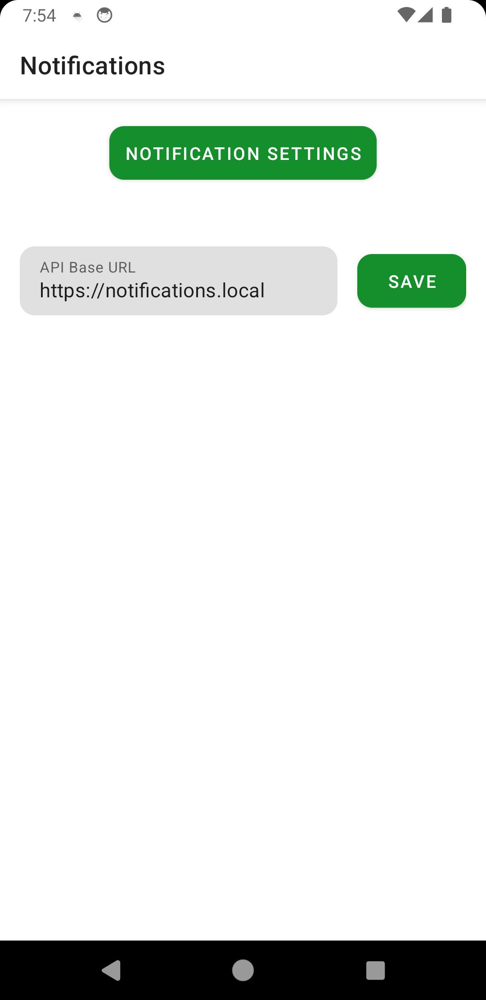
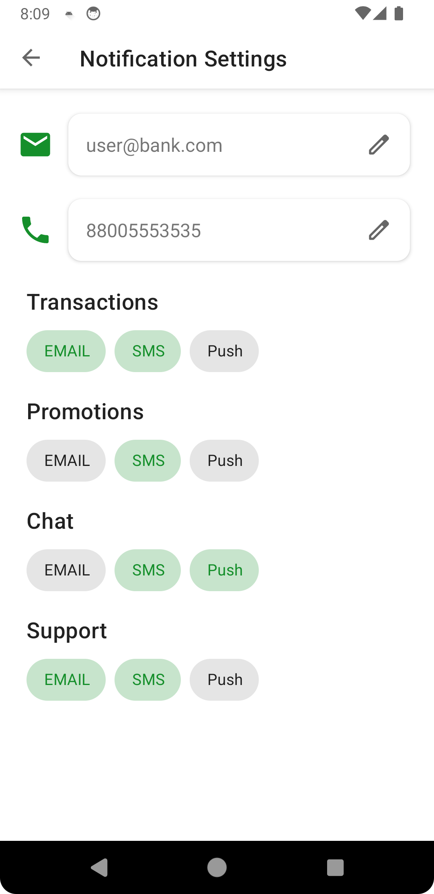

  <h3 align="center">Bank notifications Android app module</h3>

Designed for <a href="https://beautifulcode.ru">Beautiful Code 2.0 by Sber</a>

  
<b>Task description</b>

1. <b>Общее описание задачи</b>

    <b>Название задачи</b>: разработка модуля уведомлений в мобильном приложении для личного кабинета клиента.

    <b>Цель задачи</b>: проверить навыки мобильных разработчиков в разработке пользовательских интерфейсов, интеграции с бэкенд-сервисами, обработке данных и обеспечении кроссплатформенной совместимости (будет плюсом).

    <b>Описание задачи</b>: участнику предлагается разработать функциональный модуль для мобильного приложения Сбера, который позволит пользователям настраивать и получать уведомления о банковских операциях. 
    
    Пользователи должны иметь возможность выбирать типы уведомлений (SMS, push-уведомления, email) и настраивать их параметры. Модуль должен быть интегрирован с существующим интерфейсом приложения и должен корректно работать на устройствах с Android.

2. Требования к функционалу

    <b>Основной функционал</b>:

    - Настройка уведомлений:

        -	Пользователь должен иметь возможность выбрать, какие типы уведомлений он хочет получать.

        -	Для каждого типа уведомлений пользователь может выбрать способ доставки (SMS, push-уведомления, email).
        
        -	Пользователь должен иметь возможность включать или отключать каждый тип уведомлений.

    -	Интеграция с бэкендом:

        -	Модуль должен отправлять настройки уведомлений на сервер и получать подтверждение об успешном сохранении.

        -	При загрузке модуля, пользователь должен видеть текущие настройки, загруженные с сервера.

    -	Обработка ошибок:

        -	Обеспечить корректную обработку ошибок при сохранении настроек (например, проблемы с подключением к серверу).

        -	Пользователь должен получать понятные сообщения об ошибках и предложенные варианты действий (повторить запрос, изменить настройки и т.д.).

    <b>Интерфейс пользователя</b>:

    -	Интерфейс должен быть интуитивно понятным и соответствовать стандартам платформы (Android).

    -	Необходимо обеспечить адаптивный дизайн, который будет корректно отображаться на различных размерах экрана и в разных ориентациях (портретная и альбомная).

    -	Пользователь должен иметь возможность легко просматривать и изменять настройки уведомлений.

3. <b>Технические требования</b>

    <b>Язык программирования и платформы</b>:

    -	Android: Kotlin или Java.

    <b>Среда разработки</b>:

    -	Android: Android Studio.

    <b>Бэкенд-сервис</b>:

    -	Взаимодействие с RESTful API для получения и сохранения настроек пользователя:

        Необходимо использовать mock-серверы (например, JSON Server) или localStorage/IndexDB для симуляции взаимодействия с сервером. Это позволит эмулировать процессы получения и сохранения данных, обеспечивая полноценное тестирование функциональности без реального бэкенда.

    <b>Использование HTTPS для обеспечения безопасности передачи данных</b>:

    - Все данные, передаваемые между приложением и сервером (mock-сервером), должны быть защищены с использованием HTTPS, чтобы гарантировать конфиденциальность и безопасность информации.

    <b>Требования к коду</b>:

      - Код должен быть хорошо структурированным, понятным и легко расширяемым.

      -	Следовать стандартам разработки для выбранной платформы.

      -	Обязательно использование паттернов проектирования.

    <b>Тестирование</b>:

      - Провести юнит-тестирование основных функциональных модулей.

      -	Будет плюсом, написать UI-тесты для проверки интерфейса и взаимодействия с пользователем.
  

4. <b>Критерии оценки</b>

    <b>Пользовательский интерфейс (UI/UX)</b>

    -	<i>Удобство и интуитивность интерфейса</i>: Оценивается, насколько интерфейс удобен для пользователей. Участник должен создать интерфейс, который легко использовать, с интуитивно понятными элементами управления. Оценивается логичность расположения элементов, простота взаимодействия и общий пользовательский опыт.

    -	<i>Соответствие стандартам платформы</i>: Проверяется, насколько интерфейс соответствует рекомендациям и стандартам платформы (Material Design для Android). Это включает в себя использование стандартных компонентов, шрифтов, иконок и анимаций.

    -	<i>Эстетика и визуальная привлекательность</i>: Важна не только функциональность, но и внешний вид приложения. Интерфейс должен быть визуально привлекательным, с гармоничным использованием цветов, шрифтов и других элементов дизайна.

    -	<i>Адаптивность интерфейса</i>: Оценивается, насколько хорошо интерфейс адаптируется под различные устройства и экраны, включая планшеты и телефоны с разными разрешениями. Интерфейс должен оставаться удобным и функциональным при любых размерах экрана и в разных ориентациях (портретная и альбомная).

    <b>Функциональность</b>

    -	<i>Корректность работы основного функционала</i>: Оценивается, насколько корректно работает основной функционал модуля уведомлений. Это включает в себя возможность выбора типов уведомлений, настройки их параметров и сохранение настроек. Участник должен обеспечить правильное взаимодействие с бэкендом и корректное отображение изменений в интерфейсе.

    -	<i>Интеграция с бэкендом</i>: Проверяется, насколько хорошо модуль взаимодействует с сервером через API. Участник должен обеспечить корректное получение и отправку данных на сервер, включая обработку ошибок и подтверждение успешного выполнения операций.

    -	<i>Работа с уведомлениями</i>: Оценивается реализация механизма уведомлений. Участник должен правильно настроить push-уведомления и другие типы уведомлений (например, SMS, email), обеспечить их своевременное получение и корректную работу на устройстве.

    -	<i>Производительность приложения</i>: Оценивается, насколько приложение быстро и эффективно обрабатывает пользовательские запросы и взаимодействует с бэкендом. Важно, чтобы приложение работало плавно, без задержек и зависаний.

    <b>Код и архитектура</b>

    -	<i>Чистота и структурированность кода</i>: Оценивается, насколько код написан с соблюдением лучших практик разработки. Это включает в себя структурирование кода, использование правильного именования переменных и методов, адекватное разделение логики по классам и методам.

    -	<i>Использование паттернов проектирования</i>: Проверяется, использует ли участник рекомендуемые паттерны проектирования для мобильных приложений . Важно, чтобы архитектура приложения была продуманной и легко расширяемой.

    -	<i>Поддерживаемость и расширяемость кода</i>: Оценивается, насколько код легко поддерживать и расширять. Участник должен создать решение, которое можно будет легко модифицировать в будущем без необходимости вносить кардинальные изменения в архитектуру.

    -	<i>Документирование кода</i>: Проверяется наличие и качество комментариев в коде, поясняющих сложные участки и логику работы. Документация помогает другим разработчикам быстро понять, как работает приложение.
    Безопасность

    -	<i>Защита данных</i>: Оценивается, насколько хорошо участник защитил данные пользователя, передаваемые между приложением и сервером. Это включает в себя использование HTTPS для передачи данных, шифрование конфиденциальной информации и соблюдение принципов безопасности при хранении данных на устройстве.

    -	<i>Обработка ошибок и исключений</i>: Проверяется, насколько корректно приложение обрабатывает ошибки и исключения, возникающие в процессе работы. Участник должен обеспечить правильное уведомление пользователя о проблемах, минимизировать риск сбоев и защитить приложение от неожиданных ситуаций.

    -	Защита от уязвимостей:

        <i>Валидация данных на клиенте</i>:

        -	Входные данные от пользователя должны проходить строгую проверку. Например, при настройке уведомлений следует проверять корректность формата электронной почты, номеров телефонов, а также других параметров.
        -	Также стоит предусмотреть защиту от возможного ввода небезопасных данных, таких как скрипты или другие инъекционные атаки.

    <b>Тестирование</b>

    -	<i>Полнота тестов</i>: Оценивается, насколько полно участник покрыл код тестами. Тесты должны охватывать все основные сценарии использования, включая нормальные и пограничные случаи.

    -	<i>Корректность тестов</i>: Проверяется, насколько корректно написаны тесты, включая их соответствие реальным сценариям работы системы. Тесты должны проверять функциональность и указывать на возможные ошибки.

    - <i>Интеграционные тесты</i>: Оценивается наличие и качество интеграционных тестов, которые проверяют взаимодействие приложения с сервером и работу различных компонентов приложения в связке.

    -	<i>Тестирование на устройствах</i>: Оценивается, насколько хорошо приложение протестировано на реальных устройствах с разными версиями операционных систем. Участник должен убедиться, что приложение работает корректно на всех поддерживаемых устройствах и платформах.

5. <b>Рекомендации по созданию тестов</b>

    -	<i>Тестовые сценарии</i>: Создать тестовые сценарии для проверки каждого типа уведомлений, включая разные комбинации настроек.

    -	<i>Пограничные случаи</i>: Проверить работу приложения при отключении интернета, некорректных данных, пустых настройках.

    -	<i>UI-тесты</i>: Написать тесты для проверки правильности отображения интерфейса на различных устройствах и в разных ориентациях экрана.

 

## Android app

#### Built with 

- Kotlin, Coroutines, Flow
- Okhttp, Retrofit
- Unit/UI tests

  
<b>Screenshots<b>

    <pre>
       
    </pre>

#### [Get Sample APK](./client/apk/app.apk)

</> Sources [in client folder](./client)

## Sample backend API

#### Built with 

- Python 3.11
- Docker
- Caddy, FastAPI, uvicorn

</> Sources [in server folder](./server)