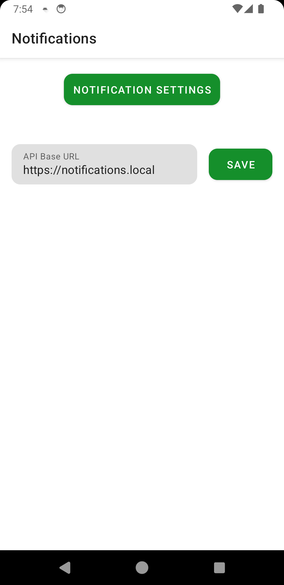

## Sample bank notifications Android app

<details>
  <summary><b>Screenshots</b></summary>
    <pre>
      <p align="center">
       </p>
      <p align="center"></p>
    </pre>
</details>

#### [Get Sample APK](./apk/app.apk)

#### Built with 

- Kotlin
- Coroutines, Flow
- Retrofit, Okhttp

#### Connect with backend API

By default, backend API available at:

- http://localhost:8000
- https://localhost
- https://notifications.local (thru mDNS)

And API docs on http://localhost:8000/docs

> [!NOTE]
>
> UI provides the ability to change the base API URL
>

See [README on server](./../server/README.md#going-live)

In short:

- To use API with self-signed certificate, add root ca to network security config via python script:

  ```bash
  pip install requests
  python ./../server/update_caddy_client_root_ca.py
  ```
- To use mDNS required Android 12 and above

- To create a notification to the channel send a post request with any value of X-API-TOKEN header:

  ```
  /api/v1/notifications/channels/{channel_id}/event
  ```

  ```json
  {
    "title": "Deposit",
    "message": "+228"
  }
  ```

  For example, create new event in `transactions` notification channel:

  ```bash
  curl --request POST \
  --url http://127.0.0.1:8000/api/v1/notifications/channels/transactions/event \
  --header 'Content-Type: application/json' \
  --header 'User-Agent: insomnia/10.0.0' \
  --header 'x-api-token: asd' \
  --data '{"title": "New deposit", "text": "+1$"}'
  ```

  Client will receive a push notification if it is enabled for channel